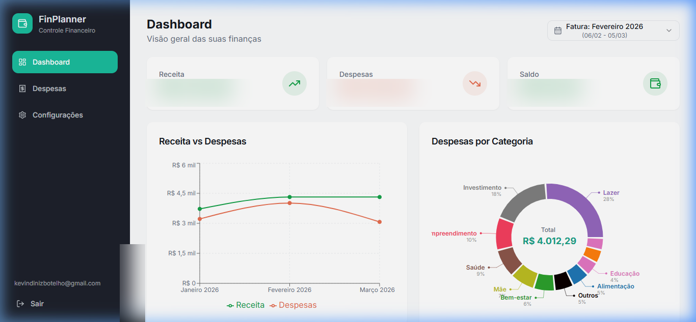
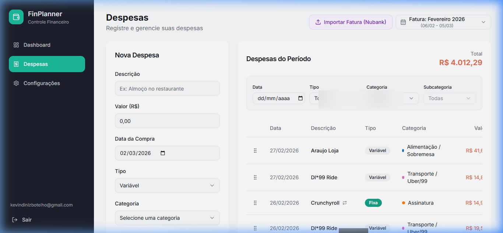

# Fin Planner 💰

O **Fin Planner** é uma solução moderna e intuitiva para gestão financeira pessoal. O que começou como um projeto para organização própria evoluiu para uma ferramenta robusta que combina simplicidade com funcionalidades avançadas.

> [!NOTE]
> O Fin Planner é **totalmente gratuito** para uso pessoal. Sinta-se à vontade para hospedar sua própria instância!

---

## 📸 Showcase

### 📊 Dashboard Inteligente
Tenha uma visão 360º de suas finanças com gráficos interativos de Receita vs Despesas e distribuição por categoria.


### 💸 Gestão de Despesas
Controle detalhado de gastos com suporte a despesas fixas e variáveis.


---

## ✨ Funcionalidades Principais

*   **🛡️ Uso Gratuito:** Sem assinaturas ou taxas. Controle total dos seus dados.
*   **🏦 Importação Nubank (CSV):** Importe suas faturas diretamente do Nubank. 
    *   *Inteligência Anti-Duplicata:* O sistema identifica automaticamente despesas já importadas anteriormente para evitar registros repetidos.
*   **🔄 Sincronização Inteligente:** Sincronize despesas inseridas manualmente com transações automáticas importadas via CSV.
*   **📅 Planejamento por Período:** Crie orçamentos (Metas) por categoria e acompanhe seu progresso mensal.
*   **🎨 Customização Total:** Crie suas próprias categorias e subcategorias para organizar suas finanças do seu jeito.

---

## 🛠️ Stack Tecnológica

O projeto utiliza o que há de mais moderno no ecossistema web:

*   **Frontend:** [React](https://reactjs.org/) + [Vite](https://vitejs.dev/) + [TypeScript](https://www.typescriptlang.org/)
*   **UI/UX:** [Tailwind CSS](https://tailwindcss.com/) + [shadcn/ui](https://ui.shadcn.com/)
*   **Backend & Autenticação:** [Supabase](https://supabase.com/) (PostgreSQL)
*   **Deployment:** [Vercel](https://vercel.com/)

---

## 🚀 Como Executar Localmente

1. **Clone o repositório:**
   ```bash
   git clone https://github.com/kevindbotelho/fin-planner.git
   cd fin-planner
   ```

2. **Instale as dependências:**
   ```bash
   npm install
   ```

3. **Configure as variáveis de ambiente:**
   Crie um arquivo `.env` baseado no `.env.example` com suas credenciais do Supabase.

4. **Inicie o servidor de desenvolvimento:**
   ```bash
   npm run dev
   ```

---

## 🤝 Contribuições

Este é um projeto *Open Source*. Sinta-se à vontade para abrir Issues ou enviar Pull Requests.

---

Desenvolvido por [Kevin Botelho](https://github.com/kevindbotelho) 🚀
